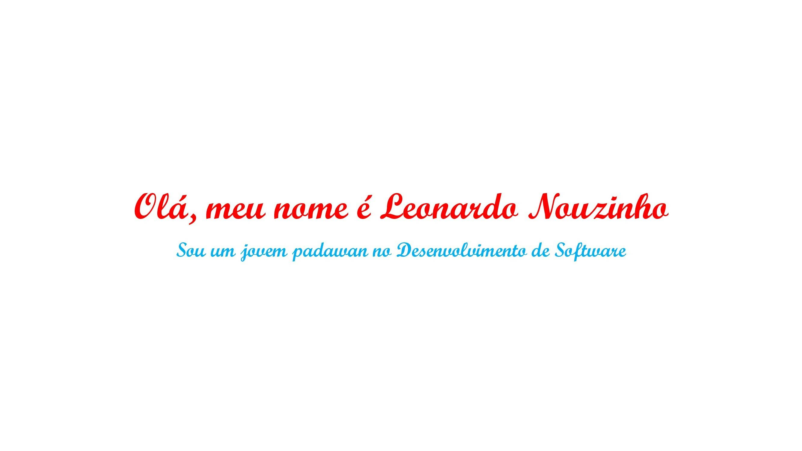
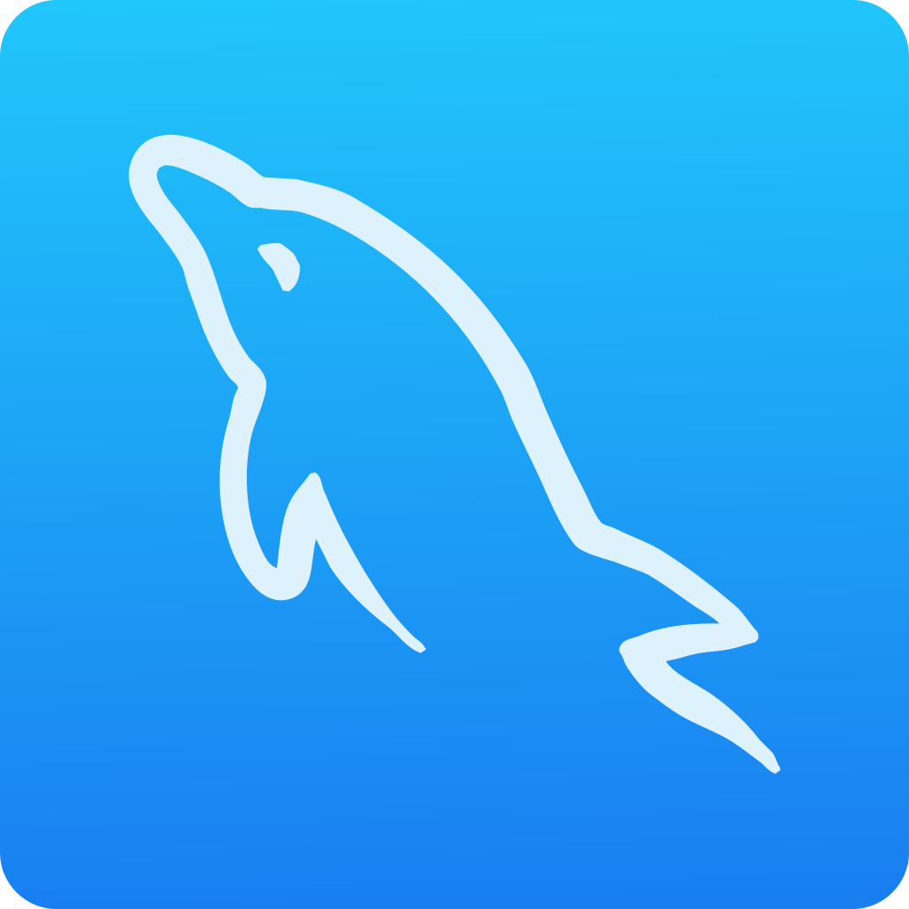
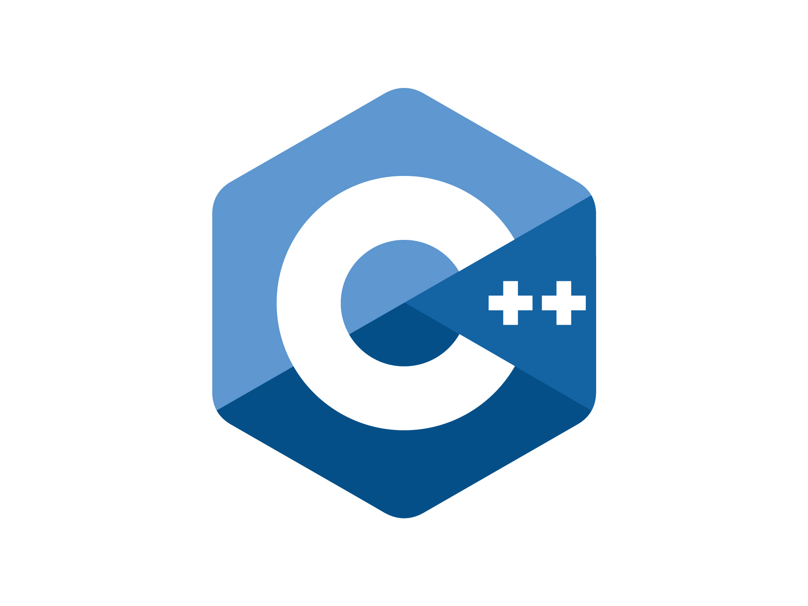
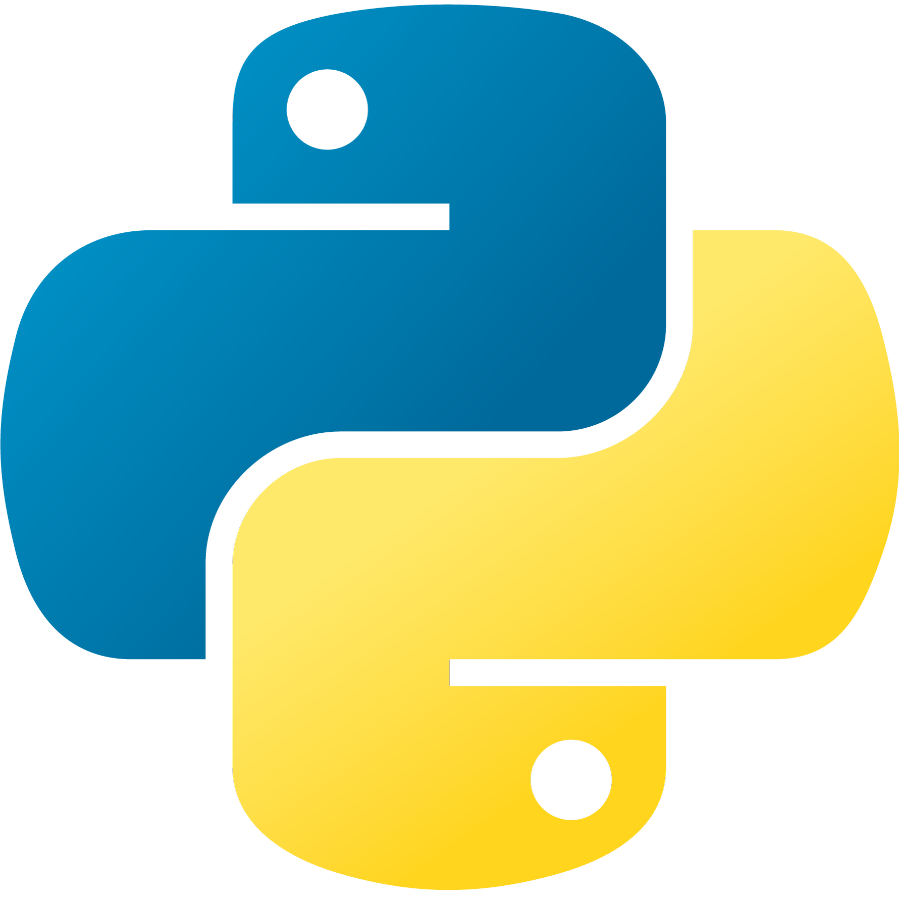

 

Eu sou um estudante aficionado por tecnologia do Brasil 🇧🇷

**Sobre mim**

- 🌱 Estudante de Desenvolvimento de Software na [Fatec Zona Sul](https://fateczonasul.edu.br/)

- 📈 Contruíndo conhecimento para me tornar um Desenvolvedor Full-Stack

- ❤️ Eu sou apaixonado por Vídeo Games e meu sonho é trabalhar na indústria internacional

- 💬 Me pergunte qualquer coisa [aqui](https://github.com/LeoNouz/LeoNouz/issues)

<code></code>
<code></code>
<code></code>
<code></code>
<code></code>
<code></code> 

- 🌱 Estudando para ser um Desenvolvedor Full-Stack
- 😄 Pronomes: ele/dele